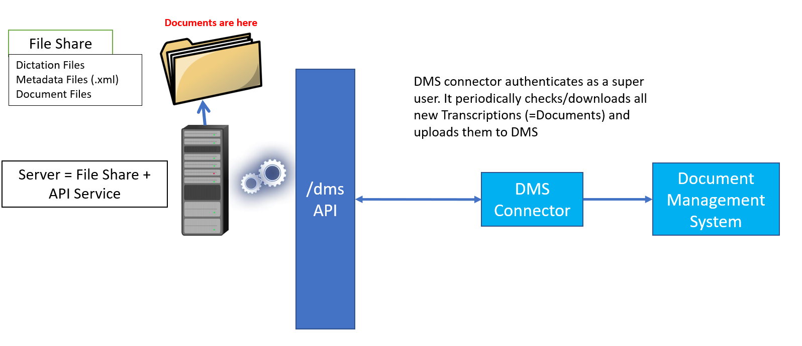
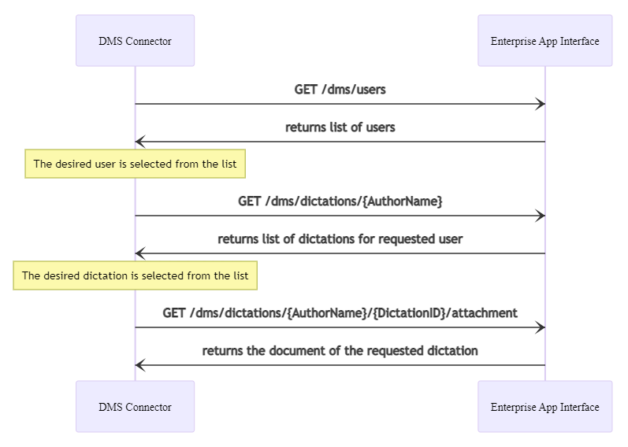

# /dms endpoints for Document Management System integrations

The `/dms` endpoints of Enterprise App Interface can be used to realize the following workflow:
1. An integrator has a system that stores and manages documents (`Document Management System` or `DMS`). These documents can come from various sources, one of them is `SpeechExec Enterprise`.

1. These documents in `SpeechExec Enterprise` are attachments of dictation files.

1. The integrator would like to "extract" documents attached to dictations files, which have been fully typed or corrected by Typists (dictation state is: Transcription Finished)

1. A software component (let's call it `DMSConnector`) is developed by an integrator to act as a middleware between the `SpeechExec Enterprise` ecosystem and `DMS`.
1. `DMSConnector` can get the needed information by sending HTTP REST requests to the `Enterprise App Interface` web service.

A simplified view:

The communication flow looks like the following:

