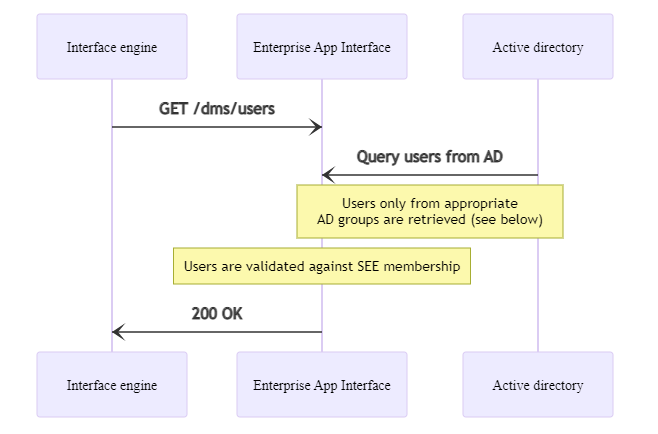

# Query all author users


## Prerequisites

HTTP request authentication must be set up properly.
You can find more information [here](./10_DmsAuthentication.md).

## Overview



## Procedure

The list of `SpeechExec Enterprise` author users can be queried using the `GET /dms/users` endpoint. This endpoint does not require any parameters.

The query first collects those users who satisfy the following criterias:
- those direct members of `SEEAllowedAuthMobile` AD group who are also direct members of any sub-group in `SEEAllowedAuth` AD group
- all direct members of those sub-groups in `SEEAllowedAuthMobile` AD group, which has a matching named sub-group in the `SEEAllowedAuth` AD group

Then all these users are validated if they are members of the `SpeechExec Enterprise` subsystem and only the valid users are involved in the result.

The call returns with the following JSON response:

``` json	
{
    "CRI": "<GUID>",
    "users": [
        {
            "username": "<string>"
        },
        ...
    ]
}
```



The `users` field contains the list of retrieved user objects. Each user object has a `username` field.

The call returns with `HTTP 401-Unauthorized` if the authentication prerequisites are not fulfilled.

The call returns with `HTTP 500-InternalServerError` if any other error occurs.

The call returns with `HTTP 200-OK` if querying the list of users is successful.

In all error cases, the exact error reason can be found in the response body, in the `FailureCode` field.

## Example

### Test application


### Return with `HTTP 401-Unauthorized` error response due to not matching API key

Request:

GET https://my.service.url/SEEAppInterface/dms/users

Headers:
```
x-sps-api-key: ""
```

Response:

401 Unauthorized
``` json
{
    "CRI": "7B2683D0-F090-45F7-8C81-69066596D91A",
    "FailureCode": "Invalid_api_key"
}
```

### Return with `HTTP 500-InternalServerError` error response due to other error

Request:

GET https://my.service.url/SEEAppInterface/dms/users

Headers:
```
x-sps-api-key: "<api_key_supported_by_server>"
```

Response:

500 InternalServerError
``` json
{
    "CRI": "7B2683D0-F090-45F7-8C81-69066596D91A",
    "FailureCode": "Generic_error"
}
```

### Return with `HTTP 200-OK` success response

Request:

GET https://my.service.url/SEEAppInterface/dms/users

Headers:
```
x-sps-api-key: "<api_key_supported_by_server>"
```

Response:

200 OK
``` json
{
    "CRI": "7B2683D0-F090-45F7-8C81-69066596D91A",
    "users": [
        {
            "username": "Sarah"
        },
        {
            "username": "John"
        }
    ]
}
```
