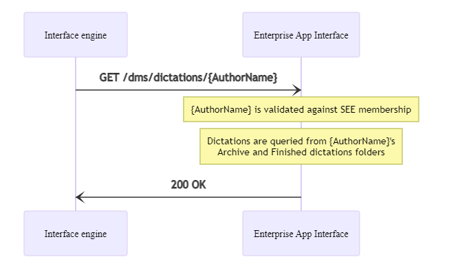

# Query dictations for a given user


## Prerequisites

HTTP request authentication must be set up properly.
You can find more information [here](./10_DmsAuthentication.md).

## Overview



## Procedure

The list of dictations for a given `SpeechExec Enterprise` user can be queried using the `GET /dms/dictations/{AuthorName}` endpoint. This endpoint requires an `AuthorName` query parameter which defines the `SpeechExec Enterprise` author user to look for.

Dictation files are searched in the user's archive folder first, then in the user's finished dictation's folder if they weren't found in the archive.

The call returns with the following JSON response:

``` json	
{
    "CRI": "<GUID>",
    "data": [
        {
            "user": "<string>",
            "role": "<integer_number>",
            "files": [
                {
                    "DictationID": "<GUID>",
                    "AudioFileName": "<string>",
                    "DictationState": "<integer_number>",
                    "HasAttachment": <true|false>,
                    "IsArchive": <true|false>,
                    "SubfolderHierarchy": "<string>",
                    "LastChangedDateTimeUtc": "<datetime_as_string>"
                },
                ...
            ]
        }
    ]
}
```



This JSON structure is designed to store dictation lists for multiple users, but in this occasion it contains only 1 item, for the specific `{AuthorName}` user.

The `data` member contains the following fields:
- `user`: name of the user who dictations are looked for
- `role`: role of the user, 0 - author, 1 - transcriptionist
- `files`: list of dictation objects

Each dictation object contains the following fields:
- `DictationID`: unique ID of dictation
- `AudioFileName`: dictation file name, with extension
- `DictationState`: dictation's workflow state
- `HasAttachment`: true if the dictation has attached document, false otherwise
- `IsArchive`: true if the dictation is located in the author user's archive folder, false otherwise
- `SubfolderHierarchy`: additional subfolder hierarchy under the root dictation folder, can be empty if no subfolder is used. Example: if the finished folder is `c:\dictations\finished` and the dictation is located in `c:\dictations\finished\Sarah\urgent`, then the subfolder hierarchy would be `Sarah\urgent`.
- `LastChangedDateTimeUtc`: The last time the dictation was changed, in UTC date format

The call returns with `HTTP 400-BadRequest` in the following cases:

- `{AuthorName}` is null or empty string
- The requested user is not member of the `SpeechExec Enterprise` subsystem

The call returns with `HTTP 401-Unauthorized` if the authentication prerequisites are not fulfilled.

The call returns with `HTTP 500-InternalServerError` if any other error occurs. 

The call returns with `HTTP 200-OK` if querying the list of dictations is successful.

In all error cases, the exact error reason can be found in the response body, in the `FailureCode` field.

## Example

### Test application


### Return with `HTTP 400-BadRequest` error response due to not existing user

Request:

GET https://my.service.url/SEEAppInterface/dms/dictations/sarah

Headers:
```
x-sps-api-key: "<api_key_supported_by_server>"
```

Response:

400 BadRequest
``` json
{
    "CRI": "BB376B59-9A82-4BB4-8CB0-314CE6DCB22A",
    "FailureCode": "User_not_exists"
}
```

### Return with `HTTP 401-Unauthorized` error response due to not matching API key

Request:

GET https://my.service.url/SEEAppInterface/dms/dictations/sarah

Headers:
```
x-sps-api-key: ""
```

Response:

401 Unauthorized
``` json
{
    "CRI": "BB376B59-9A82-4BB4-8CB0-314CE6DCB22A",
    "FailureCode": "Invalid_api_key"
}
```

### Return with `HTTP 500-InternalServerError` error response due to other error

Request:

GET https://my.service.url/SEEAppInterface/dms/dictations/sarah

Headers:
```
x-sps-api-key: "<api_key_supported_by_server>"
```

Response:

500 InternalServerError
``` json
{
    "CRI": "BB376B59-9A82-4BB4-8CB0-314CE6DCB22A",
    "FailureCode": "Generic_error"
}
```

### Return with `HTTP 200-OK` success response

Request:

GET https://my.service.url/SEEAppInterface/dms/dictations/sarah

Headers:
```
x-sps-api-key: "<api_key_supported_by_server>"
```

Response:

200 OK
``` json
{
    "CRI": "BB376B59-9A82-4BB4-8CB0-314CE6DCB22A",
    "data": [
        {
            "user": "Sarah",
            "role": 1,
            "files": [
                {
                    "DictationID": "afff53dd-71b1-4e89-9a6c-cdfc5b6089c5",
                    "AudioFileName": "test033.wav",
                    "DictationState": 2,
                    "HasAttachment": false,
                    "IsArchive": false,
                    "SubfolderHierarchy": "",
                    "LastChangedDateTimeUtc": "2015-07-31T12:43:23.4816829Z"
                },
                {
                    "DictationID": "01ab8ea4-015a-4652-8f81-c90d850d3d34",
                    "AudioFileName": "test032.dss",
                    "DictationState": 5,
                    "HasAttachment": true,
                    "IsArchive": true,
                    "SubfolderHierarchy": "ARCH_20150722",
                    "LastChangedDateTimeUtc": "2015-07-22T11:54:41.9107788Z"
                }
            ]
        }
    ]
}
```
