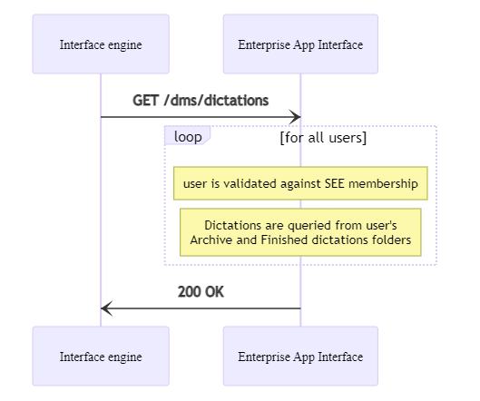

# Query all dictations for all users


## Prerequisites

HTTP request authentication must be set up properly.
You can find more information [here](./10_DmsAuthentication.md).

## Overview



## Procedure

The list of dictations for all `SpeechExec Enterprise` users can be queried using the `GET /dms/dictations` endpoint. This endpoint does not require any parameters.

Dictation files are searched in the user's archive folder first, then in the user's finished dictation's folder if they weren't found in the archive.

The call returns with the following JSON response:

``` json	
{
    "CRI": "<GUID>",
    "data": [
        {
            "user": "<string>",
            "role": "<integer_number>",
            "files": [
                {
                    "DictationID": "<GUID>",
                    "AudioFileName": "<string>",
                    "DictationState": "<integer_number>",
                    "HasAttachment": <true|false>,
                    "IsArchive": <true|false>,
                    "SubfolderHierarchy": "<string>",
                    "LastChangedDateTimeUtc": "<datetime_as_string>"
                },
                ...
            ]
        },
        ...
    ]
}
```



The `data` member in the JSON response contains as many items as the number of users which dictations could be queried for. It can also be empty if there was no users found or dictations could not be queried for any of them.

The detailed description of the JSON structure is available [here](./20_Dms_QueryDictationsForUser.md).

The call returns with `HTTP 401-Unauthorized` if the authentication prerequisites are not fulfilled.

The call returns with `HTTP 500-InternalServerError` if any other error occurs. 

The call returns with `HTTP 200-OK` if querying the list of dictations is successful. If the query process for one user fails for any reason, the specific user will be omitted from the response, but the result code would still be `HTTP 200-OK`.

In all error cases, the exact error reason can be found in the response body, in the `FailureCode` field.

## Example

### Test application


### Return with `HTTP 401-Unauthorized` error response due to not matching API key

Request:

GET https://my.service.url/SEEAppInterface/dms/dictations

Headers:
```
x-sps-api-key: ""
```

Response:

401 Unauthorized
``` json
{
    "CRI": "3C76AC6C-C1DE-4C5F-97DE-0DED5F0910F3",
    "FailureCode": "Invalid_api_key"
}
```

### Return with `HTTP 500-InternalServerError` error response due to other error

Request:

GET https://my.service.url/SEEAppInterface/dms/dictations

Headers:
```
x-sps-api-key: "<api_key_supported_by_server>"
```

Response:

500 InternalServerError
``` json
{
    "CRI": "3C76AC6C-C1DE-4C5F-97DE-0DED5F0910F3",
    "FailureCode": "Generic_error"
}
```

### Return with `HTTP 200-OK` success response

Request:

GET https://my.service.url/SEEAppInterface/dms/dictations

Headers:
```
x-sps-api-key: "<api_key_supported_by_server>"
```

Response:

200 OK
``` json
{
    "CRI": "3C76AC6C-C1DE-4C5F-97DE-0DED5F0910F3",
    "data": [
        {
            "user": "John",
            "role": 0,
            "files": [
                {
                    "DictationID": "afff53dd-71b1-4e89-9a6c-cdfc5b6089c5",
                    "AudioFileName": "test033.wav",
                    "DictationState": 1,
                    "HasAttachment": false,
                    "IsArchive": false,
                    "SubfolderHierarchy": "",
                    "LastChangedDateTimeUtc": "2015-07-31T12:43:23.4816829Z"
                },
                {
                    "DictationID": "01ab8ea4-015a-4652-8f81-c90d850d3d34",
                    "AudioFileName": "test032.dss",
                    "DictationState": 2,
                    "HasAttachment": true,
                    "IsArchive": false,
                    "SubfolderHierarchy": "Memo",
                    "LastChangedDateTimeUtc": "2015-07-22T11:54:41.9107788Z"
                }
            ]
        },
        {
            "user": "Sarah",
            "role": 1,
            "files": [
                {
                    "DictationID": "1ea29334-6008-41e4-8db5-0c88c14f6ac0",
                    "AudioFileName": "test044.wav",
                    "DictationState": 5,
                    "HasAttachment": true,
                    "IsArchive": true,
                    "SubfolderHierarchy": "ARCH_20150806",
                    "LastChangedDateTimeUtc": "2015-08-06T10:03:59.4392679Z"
                }
            ]
        }
    ]
}
```
