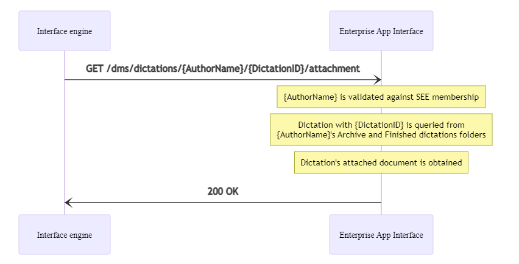

# Download attached document of a dictation


## Prerequisites

HTTP request authentication must be set up properly.
You can find more information [here](./10_DmsAuthentication.md).

## Overview



## Procedure

To download the attached document of a given dictation belonging to a specific `SpeechExec Enterprise` author user, the `GET /dms/dictations/{AuthorName}/{DictationID}/attachment` endpoint can be used. This endpoint requires an `AuthorName` and a `DictationID` query parameters which define the `SpeechExec Enterprise` author user and the desired dictation's ID to look for, respectively.

The dictation file is searched in the user's archive folder first, then in the user's finished dictation's folder if it wasn't found in the archive.

The call returns with a file stream of the dictation's attached document.

The call returns with `HTTP 400-BadRequest` in the following cases:

- `{AuthorName}` is null or empty string
- `{DictationID}` is not a valid GUID
- The requested user is not member of the `SpeechExec Enterprise` subsystem

The call returns with `HTTP 401-Unauthorized` if the authentication prerequisites are not fulfilled.

The call returns with `HTTP 404-NotFound` in the following cases:

- the dictation with the specified `{DictationID}` was not found in the cache database
- the dictation has no attachment
- the dictation is not in `Transcription finished` state

The call returns with `HTTP 500-InternalServerError` if any other error occurs. 

The call returns with `HTTP 200-OK` if the attachment download is successful.

In all error cases, the exact error reason can be found in the response body, in the `FailureCode` field.

## Example

### Test application


### Return with `HTTP 400-BadRequest` error response due to not valid dictation ID

Request:

GET https://my.service.url/SEEAppInterface/dms/dictations/sarah/not_valid_ID/attachment

Headers:
```
x-sps-api-key: "<api_key_supported_by_server>"
```

Response:

400 BadRequest
``` json
{
    "CRI": "DCD3462E-D6D8-484A-B76E-E73E9E288C4D",
    "FailureCode": "ID_not_valid"
}
```

### Return with `HTTP 401-Unauthorized` error response due to not matching API key

Request:

GET https://my.service.url/SEEAppInterface/dms/dictations/sarah/1ea29334-6008-41e4-8db5-0c88c14f6ac0/attachment

Headers:
```
x-sps-api-key: ""
```

Response:

401 Unauthorized
``` json
{
    "CRI": "DCD3462E-D6D8-484A-B76E-E73E9E288C4D",
    "FailureCode": "Invalid_api_key"
}
```

### Return with `HTTP 404-NotFound` error response due to the dictation not having attached document

Request:

GET https://my.service.url/SEEAppInterface/dms/dictations/sarah/1ea29334-6008-41e4-8db5-0c88c14f6ac0/attachment

Headers:
```
x-sps-api-key: "<api_key_supported_by_server>"
```

Response:

404 NotFound
``` json
{
    "CRI": "DCD3462E-D6D8-484A-B76E-E73E9E288C4D",
    "FailureCode": "Attachment_not_found"
}
```

### Return with `HTTP 500-InternalServerError` error response due to other error

Request:

GET https://my.service.url/SEEAppInterface/dms/dictations/sarah/1ea29334-6008-41e4-8db5-0c88c14f6ac0/attachment

Headers:
```
x-sps-api-key: "<api_key_supported_by_server>"
```

Response:

500 InternalServerError
``` json
{
    "CRI": "DCD3462E-D6D8-484A-B76E-E73E9E288C4D",
    "FailureCode": "Generic_error"
}
```

### Return with `HTTP 200-OK` success response

Request:

GET https://my.service.url/SEEAppInterface/dms/dictations/sarah/1ea29334-6008-41e4-8db5-0c88c14f6ac0/attachment

Headers:
```
x-sps-api-key: "<api_key_supported_by_server>"
```

Response:

200 OK

Headers:
```
Content-Type: "application/octet-stream"
Content-Disposition: "see_dictation_attachment; filename=test044.wav.rtf"
```

Body:

{\rtf1\ansi\ansicpg1250\deff0\nouicompat\deflang1038{\fonttbl{\f0\fnil\fcharset238 Calibri;}{\f1\fnil\fcharset0 Calibri;}}
{\*\generator Riched20 10.0.19041}\viewkind4\uc1 
\pard\sa200\sl276\slmult1\f0\fs22 This is a test document.\f1\lang14\par
}
