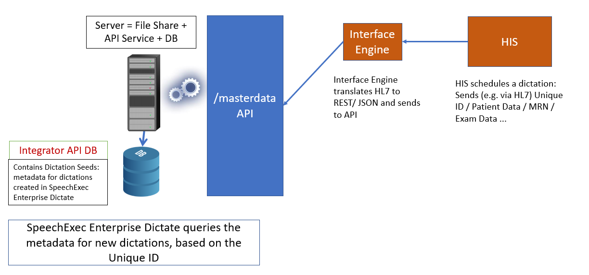

# /masterdata endpoints for HIS integrations

The `/masterdata` endpoints of Enterprise App Interface can be used to realize the following workflow:
1. A software component developed by an integrator (let's call it `Interface engine`) somehow extracts or receives dictation metadata, like patient or exam data from a Hospital information System (HIS)
2. `Interface engine` sends that metadata to `Enterprise App Interface`
3. `Enterprise App Interface` stores the information in the `Integrator API  database`. This information can be used to seed the dictation properties of newly created dictations.
4. `Enterprise Dictate` - based on the ID of a newly created dictation - can query `Enterprise Configuration Service` for dictation seed data
5. `Enterprise Configuration Service` tries to query the necessary information from the `Integrator API  database` and return the metadata

A simplified view:

