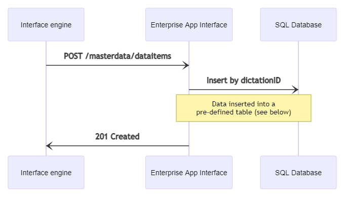

# Adding a new masterdata entry
{: .no_toc }

Contents
{: .no_toc .text-delta }

1. TOC
{:toc}

## Prerequisites

HTTP request authentication must be set up properly.
You can find more information [here](./10_MasterDataAuthentication.md).

## Overview



*The table must be named strictly as **MasterDataItemsTableForSpeechExecEnterprise**.

## Procedure

A new master data record can be inserted to the master data DB using the `POST /masterdata/dataitems` endpoint. An `InsertMasterDataRequest` request object must be passed to this endpoint when called. This request object must have the following JSON structure:

``` json	
{
    "CRI": "<GUID>",
    "dataitem": 
    {
        "ID": "<GUID>",
        "Label01": "<string>",
        "Label02": "<string>",
        "Label03": "<string>",
        "Label04": "<string>",
        "Label05": "<string>",
        "Label06": "<string>",
        "Label07": "<string>",
        "Label08": "<string>",
        "Label09": "<string>",
        "Int01": "<integer_number>",
        "Int02": "<integer_number>",
        "Int03": "<integer_number>",
        "Int04": "<integer_number>",
        "Int05": "<integer_number>",
        "Datetime01": "<datetime_as_string>",
        "Datetime02": "<datetime_as_string>",
        "Datetime03": "<datetime_as_string>",
        "Datetime04": "<datetime_as_string>",
        "Datetime05": "<datetime_as_string>"
    }
}
```

The call returns with `HTTP 400-BadRequest` in the following cases:

- The request is null
- The dataitem field is null
- The ID field is null or empty
- Any of the Datetime* fields has invalid data. These fields must specified in the following format: `yyyy-MM-dd HH:mm:ss`

The call returns with `HTTP 409-Conflict` in the following cases:

- A master data record with the same ID already exists in the DB
- An error occurs during the DB insertion process

If all the data sent in the JSON request appear to be valid, a new master data record is inserted to the master data DB and the call returns with `HTTP 201-Created` response.

In all error cases, the exact error reason can be found in the response body, in the `FailureCode` field.

## Examples

### 1. The call returns with `HTTP 400-BadRequest` due to invalid request body

Request:

POST https://my.service.url/SEEAppInterface/masterdata/dataitems
``` json
{
    "CRI": "2CBA31B2-CCCA-40A3-BEA8-771F25A748F6",
    "dataitem": 
    {
        "ID": "invalid_guid"
        ...
    }
}
```

Response:

400 BadRequest
``` json
{
    "CRI": "2CBA31B2-CCCA-40A3-BEA8-771F25A748F6",
    "FailureCode": "ID_not_valid"
}
```

### 2. The call returns with `HTTP 409-Conflict` due to primary key (ID) violation

Request:

POST https://my.service.url/SEEAppInterface/masterdata/dataitems
``` json
{
    "CRI": "2CBA31B2-CCCA-40A3-BEA8-771F25A748F6",
    "dataitem": 
    {
        // this ID already exists in the master data DB
        "ID": "DE314AC0-3E2F-47D2-A352-835AFE8845B7"
        ...
    }
}
```

Response:

409 Conflict
``` json
{
    "CRI": "2CBA31B2-CCCA-40A3-BEA8-771F25A748F6",
    "FailureCode": "ID_already_exists"
}
```

### 3. The call returns with `HTTP 201-Created` success response

Request:

POST https://my.service.url/SEEAppInterface/masterdata/dataitems
``` json	
{
    "CRI": "2CBA31B2-CCCA-40A3-BEA8-771F25A748F6",
    "dataitem": 
    {
        "ID": "DE314AC0-3E2F-47D2-A352-835AFE8845B7",
        "Label01": "data01",
        "Label02": "data02",
        "Label03": "data03",
        "Label04": "data04",
        "Label05": "data05",
        "Label06": "data06",
        "Label07": "data07",
        "Label08": "data08",
        "Label09": "data09",
        "Int01": "1",
        "Int02": "2",
        "Int03": "3",
        "Int04": "4",
        "Int05": "5",
        "Datetime01": "2021-11-04 15:35:30",
        "Datetime02": "2019-03-16 11:24:49",
        "Datetime03": "2000-01-01 06:11:17",
        "Datetime04": "1995-05-31 17:58:03",
        "Datetime05": "1776-07-04 01:11:09"
    }
}
```

Response:

201 Created

(Response body is empty)
