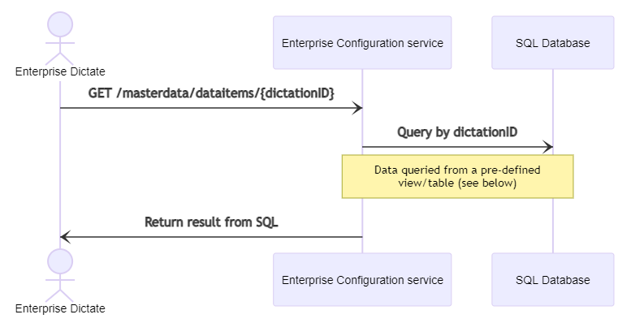

# Query an existing masterdata entry


## Remarks

This functionality is **NOT** directly offered by `Enterprise App Interface` but another component called `Enterprise Configuration service`. It is, however, part of the 'masterdata' workflow. You need to install the `Enterprise Configuration service` and connect to that service to perform the procedure described below.
Querying an existing masterdata entry is usually done by Enterprise Dictate.

## Authentication
Unlike the `masterdata` endpoints of `Enterprise App Interface` - which are designed for server-to-server communication - the `GET masterdata/dataitems` endpoint of `Enterprise Configuration service` described below **is** called by end-user applications, usually Enterprise Dictate. Requests coming from Enterprise Dictate use Windows Authentication, therefore any `GET masterdata/dataitems` request must also use the Windows Authentication (also known as NTLM) authentication type.

## Overview



*The view/table must be named as **MasterDataItemsForSpeechExecEnterprise**

## Procedure

An existing master data record can be queried from the master data SQL database  using the `GET masterdata/dataitems/{id}` endpoint. This endpoint requires an `id` query parameter which defines the master data record's ID to look for.

The call returns with the following JSON response:

``` json	
{
    "Status": "<query_status_enumeration>",
    "Data": 
    {
        "ID": "<GUID>",
        "Label01": "<string>",
        "Label02": "<string>",
        "Label03": "<string>",
        "Label04": "<string>",
        "Label05": "<string>",
        "Label06": "<string>",
        "Label07": "<string>",
        "Label08": "<string>",
        "Label09": "<string>",
        "Int01": "<integer_number>",
        "Int02": "<integer_number>",
        "Int03": "<integer_number>",
        "Int04": "<integer_number>",
        "Int05": "<integer_number>",
        "Datetime01": "<datetime_as_string>",
        "Datetime02": "<datetime_as_string>",
        "Datetime03": "<datetime_as_string>",
        "Datetime04": "<datetime_as_string>",
        "Datetime05": "<datetime_as_string>"
    },
    "AdditionalInformation": "<string>",
    "IncidentNumber": "<string>"
}
```

The `Status` field can have the following enum values:
```
OK
ERROR_NoDataFoundForID
ERROR_MultipleDataFoundForID
ERROR_DatabaseNotAvailable
ERROR_DataNotReadable
ERROR_IDIsEmpty
```

The `Data` field contains the retrieved master data record. The `AdditionalInformation` field is empty by default, but if an error occurs it can show detailed information about the exact error reason. The `IncidentNumber` field is only filled out if an error occurs.

The call always returns with `HTTP 200-OK`. The `Status` field in the response body shows the exact operation result:

- `ERROR_NoDataFoundForID`: If no master data record is found in the DB for the requested `id`
- `ERROR_MultipleDataFoundForID`: If more than one master data record is found
- `ERROR_DataNotReadable`: If an error occurs during the DB query process
- `ERROR_DatabaseNotAvailable`: If it fails to create a connection to the SQL DB

## Examples

### Return with `Status: ERROR_NoDataFoundForID` due to non-existing master data record

Request:

GET https://my.service.url/SEEConfigServiceForIIS/masterdata/dataitems/unknown_id

Response:

200 OK
``` json
{
    "Status": "ERROR_NoDataFoundForID",
    "Data": null,
    "AdditionalInformation": "",
    "IncidentNumber": "20220311130726-mosj2an0"
}
```

### Return with `Status: ERROR_DataNotReadable` due to unreachable SQL server or DB address

Request:

GET https://my.service.url/SEEConfigServiceForIIS/masterdata/dataitems/40C5571C-C8EE-477E-86AE-21996206DC89

Response:

200 OK
``` json
{
    "Status": "ERROR_DataNotReadable",
    "Data": null,
    "AdditionalInformation": "The underlying provider failed on Open.",
    "IncidentNumber": "20220311135544-uv0bdb0q"
}
```

### Return with `Status: OK` success response

Request:

GET https://my.service.url/SEEAppInterface/masterdata/dataitems/40C5571C-C8EE-477E-86AE-21996206DC89

Response:

200 OK
``` json
{
    "Status": "OK",
    "Data": 
    {
        "ID": "40C5571C-C8EE-477E-86AE-21996206DC89",
        "Label01": "data01",
        "Label02": "data02",
        "Label03": "data03",
        "Label04": "data04",
        "Label05": "data05",
        "Label06": "data06",
        "Label07": "data07",
        "Label08": "data08",
        "Label09": "data09",
        "Int01": "1",
        "Int02": "2",
        "Int03": "3",
        "Int04": "4",
        "Int05": "5",
        "Datetime01": "2021-11-04 15:35:30",
        "Datetime02": "2019-03-16 11:24:49",
        "Datetime03": "2000-01-01 06:11:17",
        "Datetime04": "1995-05-31 17:58:03",
        "Datetime05": "1776-07-04 01:11:09"
    },
    "AdditionalInformation": "",
    "IncidentNumber": ""
}
```
